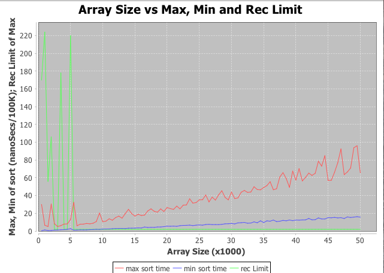

#CS1C Project 6 - exploring recursion limit of quickSort
##David M.Gudeman
##December 8, 2015 at Foothill College

Purpose: The goal of this project is to explore the recursion limit of quick
sort.  Quick sort has an unattractive official time complexity of 0(N^2). However 
the sort's average time complexity is O(nlogn). The sort is slow in the iterations
when the index of the array being evaluated nears 0. In our algorithm the sort
switches over to insertion sort when the subarrays get below the "recursion 
limit." The question is for different sized arrays what is the optimal recursion
limit to switch out of the quicksort algorithmn into another algorithmn.

Design: I wrote two programs. The first program has the main in the PlotOneMatrix 
class. This program allows a certain size of array to be evaluated for recursion 
limits starting at 2 and ranging to at least 300. The instructions ask for 300 but 
for arrays under 100K I incremented through 2000 because the  graphs I obtained 
are more descriptive if the program runs longer.

The second program goes through increasing sizes of arrays and determines the 
recursion limit for sizes of arrays from 20K to 1M in length. I then did a graph
that the arrays ranged in size from 500 to 50,000. This was because the optimal 
recursion limit of smaller arrays seemed to have a much higher value. 

I used a library called JFreeChart to graph the results.

Things new and improved for my programming development :)
In this project I successfully used an outside library downloading a jar file,
integrating it into my eclipse project and successfully implementing it. While 
doing this I researched libraies that used Maven to build them and explored one
but will save full implementation for future projects as this was taking more 
time than I had in finals week.

I first implemented the JFreeChart doubles and then went back
and re-implemented them with the Java.awt Point class. The PlotOneMatrix class
remains a hybrid class that I did not fully convert to Points but the PlotRanges
class uses only Points.  I enjoyed this because the last time I implemented the 
Point class I felt like I was just aping other code and this time I understood 
it much better. I will think of this tool much sooner in future project 
development.

Here is a typical outcome of the first program. It is for an array size of
40K.  
  
  
  
The last lines of the output are here:  
  
  
  
Here is an array with size 1,000,000. I evaluated 300 recursion limits as it 
is clear where the minimum is.  
  
  

Here is the output of the second program:  
  

Sample of the data and the completion of the run:  
  

  
I did an analysis of arrays from 500 to 50,000 in size.  The green line shows
that at arrays up to about 5000 the maximum sort time is reached on about
iteration 220. At larger arrays the max time is reached on iteration 2 
consistently. I would conclude from this that using a secondary sort method
such as insertion sort is even more critical when the array sizes are less than
5000.
  
  
  
Conclusion:
Implementing a bifurcated algorithm for quicksort with insertion sort is 
advantageous and especially so in matrices on the order of 50K and less. 
