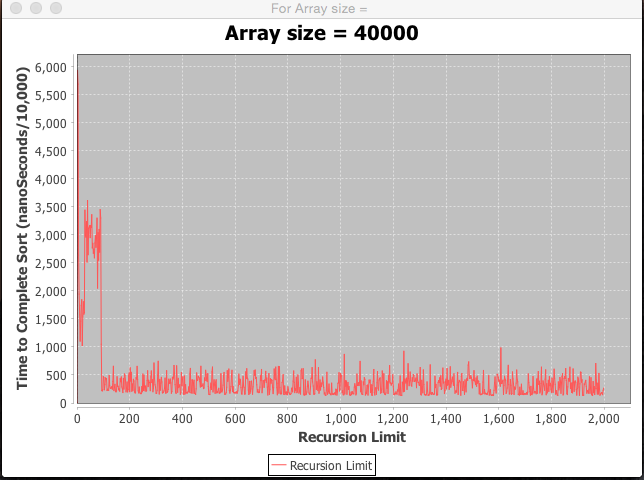
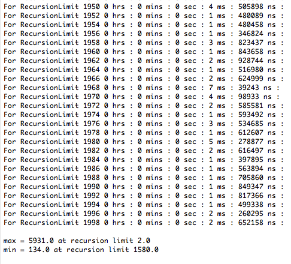
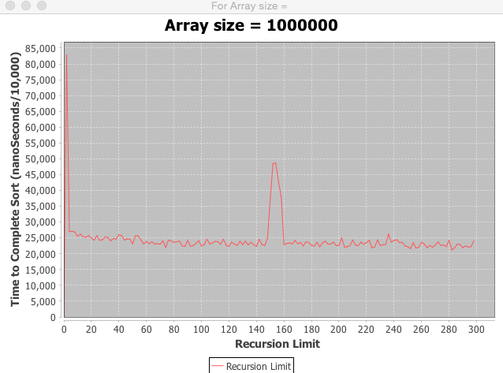
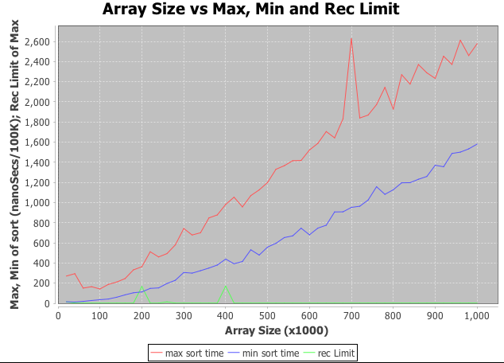
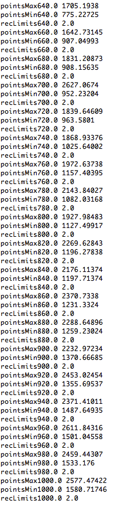

#CS1C Project 6 - exploring recursion limit of quickSort
##David M.Gudeman
##December 8, 2015 at Foothill College

Purpose: The goal of this project is to explore the recursion limit of quick
sort.  Quick sort has an unattractive time complexity of 0(N^2). However the 
sort's average time complexity is O(nlgn). The sort is slow in the iterations
when the index of the array being evaluated nears 0. In our algorithm the sort
switches over to insertion sort when the subarrays get below the "recursion 
limit." The question is for different sized arrays what is the optimal recursion
limit.

Design: I wrote two programs. The first program has the main in the Driver class.
This program allows a certain size of array to be evaluated for recursion limits
starting at 2 and ranging to at least 300. The instructions ask for 300 but 
for arrays under 100K I incremented through 2000 because the  graphs I obtained 
are more descriptive if the program runs longer.

The second program goes through increasing sizes of arrays and determines the 
recursion limit for sizes of arrays from 20K to 1M in length. I graphed the
maximum time it took to sort and then had a second graph at what array size 
that maximum occurred at.

I used a library called JFreeChart to graph the results.

In this project I successfully used an outside library downloading a jar file,
integrating it into my eclipse project and successfully implementing it. I 
looked into projects that used Maven to build them but this proved a little 
too complicated as of now during my development (but should be doable given 
a little more coaxing).

I first implemented the JFreeChart with Integer and doubles and then went back
and re-implemented them with the Java.awt Point class. I enjoyed this because 
the last time I implemented the Point class I felt like I was just aping other
code and this time I understood it much better.

Here is a typical outcome of the first program. It is for an array size of
40K.  
  
  
  
The last lines of the output are here:  
  
  
  
Here is an array with size 1,000,000. I evaluated 300 recursion limits as it 
is clear where the minimum is.  
  
  

Here is the output of the second program:  
  

Sample of the data and the completion of the run:  
  

add some changes here
