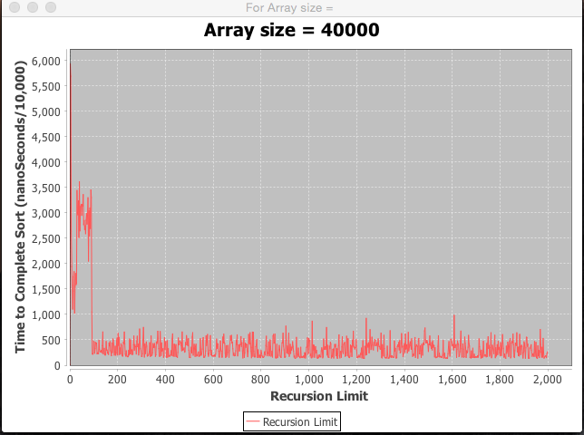
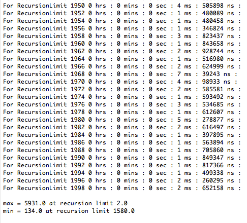
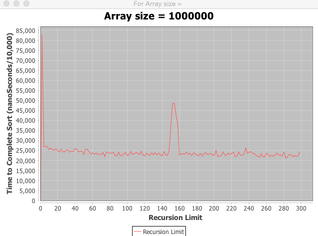

#CS1C Project 6 - exploring recusion limit of quickSort
##David M.Gudeman
##December 8, 2015 at Foothill College

Purpose: The goal of this project is to explore the recursion limit of quick
sort.  Quick sort has an unattractive time complexity of 0(N^2). However the 
sort's average time complexity is O(nlgn). The sort is slow in the iterations
when the index of the array being evaluated nears 0. In our algorithm the sort
switches over to insertion sort when the subarrays get below the "recursion 
limit." The question is for different sized arrays what is the optimal recursion
limit.

Design: I wrote two programs. The program has the main in the Driver class. This
program allows a certain size of array to be evaluated at recursion limits
starting at 2 and ranging to 2000. The instructions ask for 300 but the graphs I
obtained are more descriptive if the program runs longer.

The second program goes through increasing sizes of arrays and determines the 
recursion limit for each size and then graphs the recursion limit vs array size
and a second graph showing minimum sort time and array size.

Here is a typical outcome of the first program. It is for an array size of
40K.\s\s
\s\s
\s\s
\s\s
The last lines of the output are here:\s\s
\s\s
\s\s
\s\s
Here is an array with size 1,000,000. I evaluated 300 recursion limits as it 
is clear where the minimum is.\s\s
\s\s
\s\s

